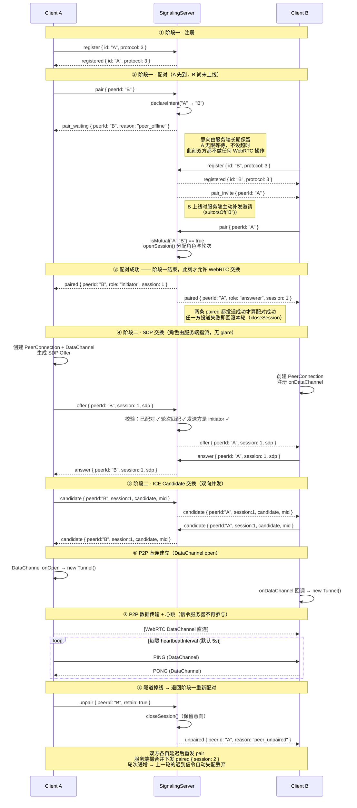

# WebRTC Tunnel - P2P NAT 穿透隧道

基于 WebRTC DataChannel 的内网穿透工具。信令服务器仅负责 SDP/ICE 交换，**数据流量完全走 P2P 直连**，不经过服务器带宽。

## 架构

```
信令服务器 (ws://)
    │
    ├── 客户端 A ──STUN──▶ 获取公网地址
    ├── 客户端 B ──STUN──▶ 获取公网地址
    │
    └── 交换 SDP Offer/Answer + ICE Candidates
              │
              ▼
        A ◀═══ P2P 直连 (DataChannel) ═══▶ B
```

## 信令协议（v3）

连接过程被严格划分为**两个阶段**，阶段的先后顺序由**服务端强制**保证，而不是依赖客户端自觉：

| 阶段 | 消息 | 保证 |
|---|---|---|
| **阶段一 · 注册与配对** | `register` → `pair` → `pair_invite` / `pair_waiting` → `paired` | 只有双方都接入服务器**且互相声明了配对意向**，服务端才下发 `paired`。在此之前不会转发任何 WebRTC 信令 |
| **阶段二 · 建连** | `offer` → `answer` → `candidate` | 每条消息都携带 `session` 轮次编号，服务端校验「已配对 + 轮次匹配 + 角色正确」后才转发 |
| **旁路 · 观测** | `status` | 客户端把自己所处阶段单向上报给服务端，仅用于排查，不参与流程、无需回复 |

协议消息与类型定义集中在 [`src/lib/protocol.ts`](src/lib/protocol.ts)，服务端与客户端共用同一份声明。

### 交互时序



### 关键设计点

| 点 | 说明 |
|---|---|
| **配对前禁止 WebRTC 交换** | 服务端 `_relayHandshake` 在无配对轮次时直接拒绝 `offer/answer/candidate` 并回 `error`，从协议层面保证，不依赖客户端自觉 |
| **注册阶段无限等待** | 配对意向（intent）由服务端长期保留，跨越对端上下线；对端一上线立即撮合。阶段一不设超时，`connectTimeout` 只在阶段二生效 |
| **角色由服务端指派** | `paired` 下发 `role`（按 id 字典序，见 `resolveRole`）。客户端不做任何仲裁，因此**双方同时 `connect()` 也不会 offer 冲突或死锁** |
| **轮次编号（session）** | 每次配对成功分配全局自增编号；阶段二消息必须携带。重连后编号递增，上一轮的迟到 candidate 在服务端与客户端两侧都会被丢弃 |
| **意向与轮次分离** | `PairRegistry` 中 intent 长期存在（支持无限等待），session 仅在双方在线且互相确认期间存在（存在即已配对） |
| **`pair` 幂等** | 对已配对的对端重复 `pair` 只会重发当前 `paired`，不推进轮次；只有 `unpair` 能作废轮次，避免重连时的 ping-pong 风暴 |
| **重复注册顶替旧连接** | 同 id 再次注册时新连接顶替旧连接，而非拒绝。网络闪断后服务端可能尚未感知旧连接已死（TCP 半开），拒绝会让客户端陷入「重连 → 被拒」死循环 |
| **信令断开不影响 P2P** | 隧道一旦建立即独立于信令通道；信令重连时也不会给已有健康隧道的对端补发邀请 |
| **服务器纯转发** | 服务器不解析 SDP / candidate 内容，仅校验元信息后原样转发 |
| **ICE candidate 缓冲** | 收到 candidate 时若本地尚未 `setRemoteDescription`，先暂存于会话的 `pendingCandidates`，SDP 设置完成后 flush |
| **心跳只在 DataChannel 内** | `PING/PONG` 走 P2P 直连，与信令 WebSocket 完全隔离 |
| **信令通道 ping/pong 保活** | 两端都对信令 WebSocket 做存活探测：服务端每 20s 巡检一次（上一轮无任何回应即 `terminate`），客户端静默 60s 未收到任何帧也强制重连。配对等待期这条连接完全静默，NAT 回收映射后会形成半开死连接，不探测就无法察觉（见下文「连接存活检测与阶段上报」） |
| **`paired` 投递校验与回滚** | 两条 `paired` 都投递成功才打印「配对成功」；任一方失败则 `closeSession` 回滚本轮、清理失效连接，并给存活方回 `pair_waiting(peer_offline)`。避免出现「一方在阶段二建连、另一方还在阶段一等待」的永久错位 |
| **阶段状态上报** | 客户端用 `status` 消息把各阶段（注册 / 配对 / SDP / ICE / 隧道）单向上报到服务端，服务端存入环形缓冲，可在状态页或 `GET /stages` 对齐双方时间线 |

> ⚠️ **协议不向后兼容**：v3 在 v2 基础上新增 `status` 上报消息与信令保活语义，且 `register` 会校验 `protocol` 版本号。**服务端与客户端必须同时升级**，已部署在远端机器的旧 `client.js` 会被服务端以 `register_failed`（协议版本不匹配）拒绝。

## 目录结构

```
webrtc_tunnel/
├── src/                          # TypeScript 源码
│   ├── lib/
│   │   ├── protocol.ts           # 信令协议：消息类型、版本号、角色分配规则、阶段枚举
│   │   ├── pair_registry.ts      # 配对状态机：意向 / 轮次（纯状态，无网络逻辑）
│   │   ├── stage_log.ts          # 客户端阶段上报的服务端存档（环形缓冲）
│   │   ├── signaling_server.ts   # 信令服务器：注册、撮合、转发校验、存活巡检
│   │   ├── status_page.ts        # 服务器 HTML 状态页渲染（含阶段时间线）
│   │   ├── client.ts             # 客户端 SDK：两阶段流程驱动
│   │   └── tunnel.ts             # 隧道连接封装（含心跳）
│   ├── bin/
│   │   ├── server.ts             # 信令服务器独立入口
│   │   └── client.ts             # 客户端独立入口
│   └── examples/
│       └── test_e2e.ts           # 端到端测试
├── dist/                         # 构建产物（打包后的单文件）
│   ├── server.js                 # 信令服务器单文件（内嵌下面两份客户端以供下载）
│   ├── client-bin.js             # 客户端单文件 · 瘦身版（node-datachannel 为外部依赖）
│   ├── client-standalone.js      # 客户端单文件 · 免安装版（内置 node-datachannel）
│   └── test_e2e.js               # 端到端测试单文件
├── rollup.config.mjs             # Rollup 打包配置
├── tsconfig.json                 # TypeScript 配置
└── package.json
```

## 安装

```bash
cd webrtc_tunnel
npm install
```

> **注意**: `node-datachannel` 是原生模块，安装时需要编译环境（Python 3、make、g++）。

## 构建

```bash
# 构建全部（两份客户端 + server + test）
npm run build

# 仅构建信令服务器
npm run build:server

# 仅构建瘦身版客户端
npm run build:client

# 仅构建免安装版客户端（内联原生扩展，耗时约 15s）
npm run build:standalone

# 仅构建端到端测试
npm run build:test
```

构建产物在 `dist/` 目录下，为单文件 JS，可直接用 `node` 运行。

> 完整构建时两份客户端必须排在 server 之前：server 会把它们的内容嵌进自己的产物里。

### 两份客户端产物的区别

业务代码是同一份源码，差别只在 `node-datachannel`（WebRTC 原生模块）的携带方式：

| 产物 | 体积 | 运行前提 | 适用场景 |
|------|------|----------|----------|
| `client-bin.js` | ~162 KB | 目标机器需 `npm install node-datachannel`（要编译环境） | 已有 Node 依赖环境、在意体积 |
| `client-standalone.js` | ~3.8 MB | 只要有 Node.js（>=16） | 干净机器、无编译环境、想一键跑 |

免安装版的原理：原生扩展（`.node`）是动态链接库，无法真的变成 JavaScript，因此打包时把它
brotli 压缩成 base64 内联进产物（9.8MB → 3.6MB），首次运行时还原成磁盘文件再 `dlopen`。
解包结果缓存在 `~/.cache/webrtc-tunnel/native/`（按版本与内容哈希命名），二次启动直接复用；
目录不可写或挂了 `noexec` 时，可用环境变量 `WEBRTC_TUNNEL_NATIVE_DIR` 另指一个目录。

> **免安装版与构建机的平台 + 架构绑定**（当前为 `linux-x64`、基于 glibc）。平台不匹配时客户端
> 会直接报错并提示改用瘦身版。要在一台机器上为别的平台打包，先用 `prebuild-install` 取到对应
> 平台的 `.node`，再通过 `ND_NATIVE_PATH` / `ND_NATIVE_PLATFORM` / `ND_NATIVE_ARCH` 指定。

## 使用方式

### 1. 启动信令服务器

```bash
# 使用打包后的单文件
node dist/server.js [端口]

# 默认端口 9876
node dist/server.js

# 或使用 npm script
npm run server
```

**HTTP 端点**（用于健康检查、状态查看和客户端下载）：

| 端点 | 说明 |
|------|------|
| `GET /` | 浏览器访问返回 HTML 状态页面（含在线客户端列表与各自当前阶段、配对状态、阶段上报时间线，每 5 秒自动刷新）；API 访问（`Accept: application/json`）返回 JSON |
| `GET /health` | 健康检查，始终返回 JSON |
| `GET /stages` | 客户端阶段上报的时间线（JSON，最近 200 条），排查建连问题的主入口 |
| `GET /client.js` | 下载客户端脚本 · 瘦身版（构建时自动嵌入，需目标机器自备 node-datachannel） |
| `GET /client-standalone.js` | 下载客户端脚本 · 免安装版（构建时自动嵌入，含原生扩展，单文件即可运行） |

```bash
# 健康检查
curl http://localhost:9876/health
# {"status":"ok","clients":2,"pairs":1,"uptime":123,"timestamp":"..."}

# 查看双方建连各阶段的时间线
curl http://localhost:9876/stages

# 下载客户端脚本（两份任选，浏览器打开 `/` 也能看到下载入口与体积）
curl -O http://localhost:9876/client.js              # 瘦身版
curl -O http://localhost:9876/client-standalone.js   # 免安装版
```

### 2. 启动客户端

**本地开发/测试**：

```bash
# 客户端 B（被动等待连接）
node dist/client-bin.js --id client-b

# 客户端 A（主动连接 B）
node dist/client-bin.js --id client-a --connect client-b

# 指定信令服务器地址
node dist/client-bin.js --id client-a --connect client-b --signaling ws://1.2.3.4:9876
```

**远程机器部署**：

方式一 · 免安装版（推荐，目标机器只需 Node.js，无需 npm install、无需编译环境）：

```bash
# 1. 下载并运行
curl -O http://<服务器地址>:9876/client-standalone.js
node client-standalone.js --id remote-node --connect peer-id

# 一个命令搞定
SERVER="<服务器地址>" && curl -sL "http://$SERVER/client-standalone.js" | node - --id client_b --connect client_a --signaling "ws://$SERVER"
SERVER="<服务器地址>" && curl -sL "http://$SERVER/client-standalone.js" | node - --id client_a --signaling "ws://$SERVER"
```

> 首次运行会打印一行 `[native] 已解包内置 node-datachannel ...`，属正常现象（见「两份客户端产物的区别」）。

方式二 · 瘦身版（体积小，但需要先装原生依赖）：

```bash
# 1. 在远程机器上安装依赖（需要 Node.js 和编译环境）
./install-client.sh

# 2. 从信令服务器下载客户端脚本
curl -O http://<服务器地址>:9876/client.js

# 3. 运行
node client.js --id remote-node --connect peer-id

# 一个命令搞定
SERVER="<服务器地址>" && curl -sL "http://$SERVER/client.js" | node - --id client_b --connect client_a --signaling "ws://$SERVER"
SERVER="<服务器地址>" && curl -sL "http://$SERVER/client.js" | node - --id client_a --signaling "ws://$SERVER"
```

> **注意**: 瘦身版依赖的 `node-datachannel` 是原生模块，安装时需要 Python 3、make、g++ 编译环境。
> 目标机器装不上（无编译环境 / 无外网）时，请改用免安装版。

**命令行参数**:

| 参数 | 必填 | 说明 |
|------|------|------|
| `--id <string>` | 是 | 本客户端唯一标识 |
| `--connect <string>` | 否 | 启动后立即声明与该目标配对 |
| `--signaling <url>` | 否 | 信令服务器地址，默认 `ws://127.0.0.1:9876` |
| `--no-reconnect` | 否 | 禁用自动重连 |
| `--reconnect-interval <ms>` | 否 | 重连间隔，默认 5000ms |
| `--max-reconnect <n>` | 否 | 最大重连次数，0=无限（默认） |
| `--no-report` | 否 | 不向服务端上报建连阶段状态（默认上报） |
| `--quiet` | 否 | 不输出「注册 → 配对 → 建连」的阶段流转日志 |

> **双方都可以指定 `--connect` 指向对方**：角色由信令服务器分配，不会产生 offer 冲突。事实上只有一方指定 `--connect` 也能建连 —— 另一方会收到 `pair_invite` 并自动确认。

**自动重连**：

客户端默认启用自动重连功能：
- 信令服务器断开后自动重连并重新注册，随后自动补发仍处于配对阶段的意向
- P2P 隧道断开后**退回阶段一重新配对**（发 `unpair {retain:true}` 作废旧轮次，延迟后重发 `pair`），由服务端撮合出新一轮
- 信令连接断开**不会**关闭已建立的 P2P 隧道

```bash
# 禁用自动重连
node client.js --id my-node --no-reconnect

# 自定义重连间隔（10 秒）
node client.js --id my-node --reconnect-interval 10000

# 最多重连 5 次
node client.js --id my-node --max-reconnect 5
```

### 3. 作为模块集成

```typescript
import { WebRTCTunnelClient } from './lib/client';
import type { Tunnel } from './lib/tunnel';

const client = new WebRTCTunnelClient({
  id: 'my-node',
  signalingUrl: 'ws://signaling-server:9876',
});

// 【阶段一】连接信令服务器并注册
await client.connectSignaling();

// 观察阶段流转（可选）
client.on('pair-waiting', (peerId, reason) => console.log(`等待 ${peerId}: ${reason}`));
client.on('paired', (peerId, role) => console.log(`已与 ${peerId} 配对，角色 ${role}`));

// 隧道统一入口：主动 / 被动、首次 / 重连的每一条隧道都会派发 'tunnel'。
//
// 必须在这里绑定业务逻辑，不要只用 connect() 的返回值 —— 隧道掉线重连后库会换出
// 一个全新的 Tunnel 对象，而 connect() 的 promise 只结算一次。只绑首条隧道的话，
// 重连后本端既发不出数据也收不到 'data'，但两端与服务端都仍显示「隧道已建立」，
// 表现为通道假成功。
client.on('tunnel', (tunnel: Tunnel, peerId: string, info) => {
  console.log(`隧道已建立 ⇄ ${peerId} [${info.role}]${info.reconnected ? '（重连）' : ''}`);
  tunnel.on('data', (buf: Buffer) => console.log('收到:', buf));
  tunnel.send(Buffer.from('hello'));
});

// 【阶段一 → 阶段二】声明配对意向。
// 对端未上线时会一直等待（不超时），配对成功后才开始交换 WebRTC 信令。
// 这里 await 只用于等待首次建连（便于启动阶段就发现问题）。
await client.connect('peer-id');

// 被动接受对端发起的配对无需调用 connect()，同样由上面的 'tunnel' 接管。
// 需要随时取当前隧道时用 getTunnel / tunnels，而不是缓存 Tunnel 对象：
client.getTunnel('peer-id')?.send(Buffer.from('hi'));
```

### 4. 运行测试

```bash
# 端到端测试（同进程内启动信令服务器与多个客户端）
npm run build:test && node dist/test_e2e.js

# 或使用 npm script（需先构建）
npm test
```

覆盖的用例：

| # | 用例 | 验证点 |
|---|------|--------|
| 1 | 对端未接入时的配对阶段 | 收到 `pair_waiting(peer_offline)`；**不会**下发 `paired`、不交换任何 WebRTC 信令；`connect()` 保持等待而非超时失败 |
| 2 | 对端接入后自动撮合 | 服务端补发 `pair_invite` → 配对成功 → 角色互补 → 双向文本 / 二进制数据传输 |
| 3 | 双方同时 `connect()` | 不死锁（glare 回归测试），双方获得互补角色且隧道可用 |
| 4 | 未配对时发送 `offer` | 服务端回 `error`，拒绝转发 |
| 5 | 注册前置校验 | 未注册就发 `pair` 被拒；`protocol` 版本不匹配时 `register_failed` |

## API 参考

### `WebRTCTunnelClient`

| 方法 | 返回值 | 说明 |
|------|--------|------|
| `connectSignaling()` | `Promise<void>` | 【阶段一】连接信令服务器并完成注册 |
| `connect(peerId)` | `Promise<Tunnel>` | 声明与 peer 配对并等待隧道建立。配对阶段不超时；双方可同时调用 |
| `disconnectPeer(peerId)` | `void` | 断开与指定 peer 的隧道并撤销配对意向（不再自动重连） |
| `close()` | `void` | 断开所有隧道并关闭信令连接 |
| `getTunnel(peerId)` | `Tunnel \| null` | 获取指定 peer 的隧道 |
| `tunnels` (getter) | `Map<string, Tunnel>` | 所有活跃隧道 |
| `isRegistered` (getter) | `boolean` | 是否已在信令服务器注册 |
| `setAutoReconnect(peerId, enable)` | `void` | 设置 peer 在隧道掉线后是否自动重新配对 |

**构造参数**:

```typescript
new WebRTCTunnelClient({
  id: 'my-node',
  signalingUrl: 'ws://...',
  iceServers: ['stun:stun.l.google.com:19302'],
  heartbeatInterval: 5000,          // P2P 心跳间隔
  heartbeatTimeout: 15000,          // P2P 心跳超时
  connectTimeout: 30000,            // 【仅阶段二】SDP/ICE 交换超时，不影响阶段一的无限等待
  signalingPingInterval: 20000,     // 信令通道 ping 间隔，0 = 关闭保活（不建议）
  signalingIdleTimeout: 60000,      // 信令通道静默超时，超时即强制重连
  reportStatus: true,               // 是否向服务端上报建连各阶段状态
  verbose: false,                   // 是否输出阶段流转日志
  acceptPeer: (peerId) => true,     // 收到配对邀请时的准入判断，返回 false 则拒绝
  reconnect: {
    signalingReconnect: true,       // 信令服务器自动重连
    signalingReconnectInterval: 3000, // 信令重连间隔
    tunnelReconnect: true,           // 隧道掉线后自动重新配对
    tunnelReconnectInterval: 5000,   // 重新配对的延迟
    maxReconnectAttempts: 0,         // 0 = 无限
  },
});
```

**事件**:

| 事件 | 参数 | 阶段 | 说明 |
|------|------|------|------|
| `registered` | `()` | 一 | 在信令服务器注册成功 |
| `pair-invite` | `(peerId: string)` | 一 | 收到对端的配对邀请（已自动确认） |
| `pair-waiting` | `(peerId: string, reason: string)` | 一 | 配对未完成，正在等待对端（`peer_offline` / `awaiting_peer`） |
| `paired` | `(peerId: string, role: PeerRole)` | 一→二 | 配对成功，进入建连阶段。`role` 为服务端指派 |
| `unpaired` | `(peerId: string, reason: string)` | — | 配对被解除（`peer_disconnected` / `peer_unpaired` / `peer_repairing`） |
| `tunnel` | `(tunnel: Tunnel, peerId: string, info)` | 二 | **推荐订阅**：隧道建立，含每一次重连。`info` 为 `{ peerId, role, passive, reconnected }` |
| `connection` | `(tunnel: Tunnel, peerId: string)` | 二 | 【兼容】被动接受的连接建立成功 |
| `connected` | `(tunnel: Tunnel, peerId: string)` | 二 | 【兼容】主动 `connect()` 建立成功 |
| `disconnected` | `()` | — | 与信令服务器断开（不影响已建立的隧道） |
| `reconnecting` | `(attempt: number)` | — | 正在重连信令服务器 |
| `reconnected` | `()` | — | 信令服务器重连成功 |
| `tunnel-reconnecting` | `(peerId: string, attempt: number)` | — | 隧道正在重新配对 |
| `tunnel-reconnected` | `(peerId: string)` | — | 隧道重连成功 |
| `error` | `(err: Error)` | — | 全局错误 |

### `Tunnel`

| 方法 | 说明 |
|------|------|
| `send(data: Buffer \| Uint8Array \| string)` | 发送数据 |
| `close()` | 关闭隧道 |
| `isClosed()` | 是否已关闭 |

**事件**:

| 事件 | 参数 | 说明 |
|------|------|------|
| `data` | `(buf: Buffer)` | 收到数据 |
| `close` | `()` | 隧道关闭 |
| `error` | `(err: Error)` | 发生错误 |

### `SignalingServer`

```typescript
import { SignalingServer } from './lib/signaling_server';

const server = new SignalingServer({
  port: 9876,
  pingInterval: 20000,      // 存活巡检间隔，0 = 关闭（不建议）
  stageLogCapacity: 500,    // 阶段上报保留条数
  logStageReports: true,    // 是否把上报打印到控制台
});
await server.start();

// 查看在线数量与已配对数量
console.log(server.clientCount, server.pairCount);

// 取客户端阶段上报时间线（新 → 旧）
console.log(server.stageEvents(50));

// 停止
await server.stop();
```

也可以挂载到已有的 `http.Server` 上：

```typescript
const server = new SignalingServer({ server: existingHttpServer });
```

## 心跳机制

- `initiator` 一方（由信令服务器指派）每 **5 秒**发送 `PING`
- 收到 `PING` 的一方自动回复 `PONG`
- 双方 **15 秒**未收到任何消息则判定断线，自动关闭隧道并触发 `error` 事件（随后按配置退回阶段一重新配对）
- 心跳完全走 P2P DataChannel，与信令 WebSocket 无关：信令服务器宕机不会导致已建立的隧道断开

可通过构造参数自定义：

```typescript
new WebRTCTunnelClient({
  id: 'my-node',
  signalingUrl: 'ws://...',
  heartbeatInterval: 5000,  // 心跳间隔
  heartbeatTimeout: 15000,  // 超时时间
});
```

## 连接存活检测与阶段上报

### 为何需要

配对等待期（一方已上线、另一方未到）信令 WebSocket 上没有任何流量。一旦 NAT / 防火墙
回收空闲映射，连接就会变成 **半开死连接**：双方都收不到 `close`，服务端把死 socket
当成在线客户端继续撮合，`paired` 与 SDP 全部转发进黑洞，表现为：

- 死链一端：永久停在「等待与 xxx 配对」，像假死；
- 对端：反复「配对成功 → 建连超时 → 重新配对」，直到操作系统级 TCP 超时（可能十几分钟）才恢复。

### 两道防线

| 机制 | 位置 | 行为 |
|------|------|------|
| 服务端存活巡检 | `_sweepDeadConnections` | 每 `pingInterval`（默认 20s）一轮：上一轮未收到任何帧的连接直接 `terminate` 并走正常断开清理，随后对存活连接发一次 `ping` |
| 客户端静默超时 | `_startSignalingKeepalive` | 每 `signalingPingInterval` 主动 `ping`；超过 `signalingIdleTimeout`（默认 60s）未收到服务端任何帧则 `terminate`，交由既有重连逻辑重建 |

两者都用 `terminate` 而非 `close`：死连接上的关闭握手永远发不出去，只有强制销毁才会立刻触发 `close`。

### 阶段上报

客户端把建连过程的每一步用 `status` 消息单向上报到服务端（不等回复、失败不重试，绝不影响连接流程）：

| 阶段 | 含义 | 携带的 detail |
|------|------|------|
| `registered` | 已在信令服务器注册 | 首次注册 / 信令重连后重新注册 |
| `pair_declared` | 已声明配对意向 | — |
| `pair_confirmed` | 已确认对端的配对邀请 | — |
| `pair_waiting` | 等待对端（无限等待） | 等待原因 |
| `paired` | 配对成功，进入阶段二 | 本方角色 |
| `offer_sent` / `offer_received` | SDP Offer 已发 / 已收 | — |
| `answer_sent` / `answer_received` | SDP Answer 已发 / 已收 | — |
| `ice_gathering` | ICE 候选收集状态变化 | 收集状态 + 本地候选数 |
| `pc_state` | PeerConnection 状态变化 | 具体状态（connecting / connected / failed 等） |
| `tunnel_open` | P2P 隧道已建立 | 角色 + 双方候选数 |
| `tunnel_closed` | 隧道断开 | — |
| `handshake_failed` | 建连失败 / 超时 | 错误信息 + 双方候选数 |
| `unpaired` | 配对被解除 | 解除原因 |
| `repairing` | 正在重新配对 | 第几次、多久后发起 |

服务端用 [`StageLog`](src/lib/stage_log.ts) 存成环形缓冲（默认 500 条，内存有上界），时间戳取服务端
收到的时刻（不采信客户端时钟，避免两台机器时钟不同步导致时间线错乱），**不随客户端断开而清除**
—— 客户端掉线前最后几条上报往往正是关键线索。

查看方式：

```bash
# JSON 时间线（新 → 旧，最近 200 条）
curl http://<服务器>:9876/stages

# 浏览器打开状态页，在线客户端后面直接标出各自当前阶段，下方是合并后的时间线
open http://<服务器>:9876/
```

服务端控制台也会直接打印（可用 `logStageReports: false` 关闭）：

```
[信令] 阶段上报: client-a → "client-b"  已配对 轮次 #3: 角色=initiator
[信令] 阶段上报: client-a → "client-b"  建连失败 轮次 #3: 与 "client-b" 建连超时 (30000ms)（本地候选 6 条，远端候选 0 条）
```

> 上面这两行就是典型的单边错位：本方以为配对成功，但远端候选数为 0 说明对端根本没参与本轮。

上报可用 `--no-report`（CLI）或 `reportStatus: false`（SDK）关闭。

## 配对状态清理机制

信令服务器用 [`PairRegistry`](src/lib/pair_registry.ts) 管理两类状态，二者生命周期不同：

| 状态 | 生命周期 | 作用 |
|------|----------|------|
| **配对意向**（intent） | 长期，跨越对端上下线 | 支撑「注册阶段无限等待」：对端一上线就自动撮合 |
| **配对轮次**（session） | 短暂，仅在双方在线且互相确认期间存在 | 存在即已配对，是允许转发 SDP/ICE 的唯一凭据 |

任一客户端断开时，服务器自动：

1. 作废它参与的所有配对轮次；
2. 向所有受影响的对端推送 `unpaired { reason: 'peer_disconnected' }`，对方随即关闭隧道；
3. 清除**它自己声明**的意向（重新上线后客户端会重新声明），但**保留别人对它的意向** —— 这样它再次上线时能被自动重新撮合。

这确保了：
- 客户端重启使用相同 ID 可以正常重新配对（同 id 重连时新连接顶替旧连接，不会被拒绝）
- 不会出现"幽灵"配对导致连接失败（轮次编号递增，旧轮次的迟到信令必然失配）
- 双方都能及时感知对方断开

## 依赖说明

| 依赖 | 用途 | 打包情况 |
|------|------|----------|
| `ws` | WebSocket 信令通信 | ✅ 打包进单文件 |
| `node-datachannel` | WebRTC DataChannel | 看产物：`client-bin.js` ✅ 保持外部依赖；`client-standalone.js` ✅ 连原生扩展一起内联 |

> 服务端（`server.js`）只做信令，不需要 `node-datachannel`，但会把两份客户端产物作为字符串
> 嵌进自己的单文件里（因此约 4.2MB），使使用者能从 `/client.js` 与 `/client-standalone.js`
> 自行选择下载哪一份。瘦身版的 `ws` 已打包在内，只差 `node-datachannel`。
